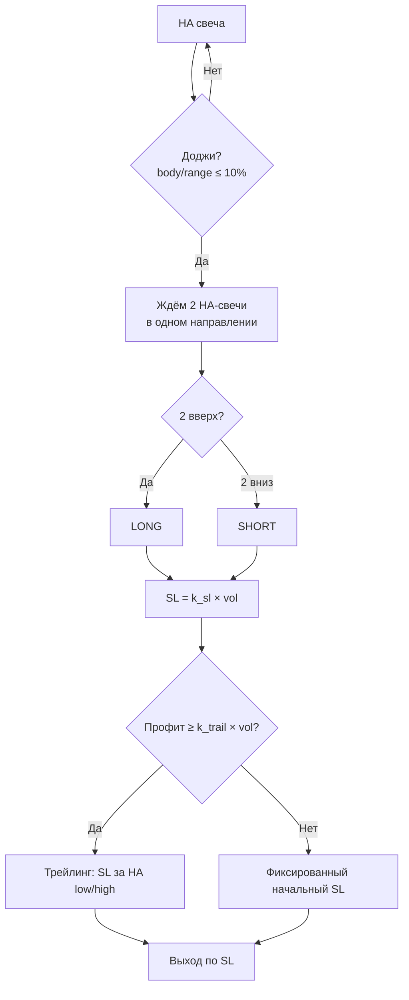

# Heiken Ashi — стратегия разворота и динамический Stop-Loss

Документ фиксирует результаты бэктеста на данных `storage/data` и рекомендуемые параметры.
Планируется повторный анализ на **большом массиве данных** (расширенный период и больше символов).

Связанный код: `core/trading.Future` (`future_stop_loss.go`), индикатор HA: `core/candle_indicator`.

---

## Идея стратегии

1. Определяем **разворот тренда** по свечам **Heiken Ashi**.
2. После **доджи** ждём **2 HA-свечи подряд** в новом направлении.
3. Входим на **open следующей** реальной свечи.
4. Управляем позицией **динамическим SL** от волатильности + **трейлинг** после достижения порога профита.



---

## Данные бэктеста (текущий срез)

| Параметр | Значение |
|----------|----------|
| Файл свечей | `storage/data/crypto_app_crypto_polymath_candlestick.csv` |
| Файл HA | `storage/data/crypto_app_crypto_poandlestick_indicators.csv` (BTC, валидация) |
| Символов | 501 (анализ на 499 с ≥80 свечей) |
| Таймфрейм | 1 час |
| Период | ~2026-07-05 18:00 → 2026-07-09 21:00 (~100 ч) |
| Средний B&H | −2.85% (медвежий фон) |

---

## Сигнал входа

### Heiken Ashi

Формула (`core/candle_indicator/calculators/heiken_ashi.go`):

```
HA_open  = (prev_HA_open + prev_HA_close) / 2   // первая свеча: raw open
HA_close = (O + H + L + C) / 4
HA_high  = max(H, HA_open, HA_close)
HA_low   = min(L, HA_open, HA_close)
```

### Доджи

```go
IsHeikenAshiDoji(open, close, high, low, dojiThresholdPct)
// body/range × 100 ≤ 10%  (или body == 0)
```

### Подтверждение разворота

После доджи в течение **3 свечей** должны закрыться **2 HA-свечи** в одном направлении:

| Направление | Действие |
|-------------|----------|
| 2× up | LONG на open следующей свечи |
| 2× down | SHORT на open следующей свечи |

Пока позиция открыта — новые сигналы игнорируются.

---

## Stop-Loss: эволюция гипотез

### 1. Трейлинг с входа (отклонено)

SL = HA low/high предыдущей свечи с момента входа.

| Метрика | Результат |
|---------|-----------|
| Win rate | 23.8% |
| Total PnL | −235% (сумма % по сделкам) |
| Проблема | SL слишком tight, 82% сделок ≤3 ч с убытком |

### 2. Фиксированный SL на марже (частично)

| Параметр | Baseline | Лучший фиксированный |
|----------|----------|----------------------|
| Плечо | 5x | 3x |
| Начальный SL | −10% маржи | −25% маржи (−8.3% цены) |
| Трейлинг после | +10% маржи | +20% маржи (+6.7% цены) |
| Total PnL | −3 954% | **+243%** |
| PF | 0.63 | 1.04 |

Short-only (3x, −25%, +20%): **+2 501%**, WR 58%, PF 1.60.

### 3. Динамический SL от волатильности (рекомендуется)

**Теория подтверждена:** SL = коэффициент × волатильность свечи.

```
sl_price_%    = clamp(k_sl   × volatility, sl_floor, sl_cap)
trail_price_% = clamp(k_trail × volatility, trail_floor, trail_cap)

margin_pnl_%  = price_change_% × leverage
```

#### Меры волатильности

| Мера | Формула | Результат в бэктесте |
|------|---------|----------------------|
| **range_pct** | `(HA_high − HA_low) / close × 100` | **Лучший** (+1 191%) |
| atr_pct | `avg((H−L)/close)` за 14 свечей | +1 060% |
| mkt_vol | `0.5×ATR + 0.3×std + 0.2×range` | +619% |

Медиана `mkt_vol` в данных: **1.08%**, медиана `range_pct`: **~2%**.

#### Лучшая динамическая конфигурация

| Параметр | Значение |
|----------|----------|
| Плечо | **5x** |
| k_sl | **4.0** |
| k_trail | **4.0** |
| Мера | **range_pct** |
| sl_floor | **3%** цены (для низкой волатильности) |
| trail_floor | **2%** цены |

| Метрика | Фиксированный (лучший) | **Динамический** |
|---------|------------------------|------------------|
| Сделок | 969 | 1 565 |
| Win rate | 50.3% | **50.7%** |
| Total PnL | +243% | **+1 191%** |
| PF | 1.04 | **1.10** |

#### Short + dynamic + floor (лучший режим)

```
5x | k_sl=4 | k_trail=4 | range_pct | sl_floor=5% | SHORT only
→ Total +4 198%, WR 55.8%, PF 1.57
```

---

## Поведение по квартилям волатильности

(5x, k=4, range_pct)

| Квартиль vol | Средний SL | Win rate | Средний PnL |
|--------------|------------|----------|-------------|
| Q1 низкая | 2.6% | 43.5% | −1.17% |
| Q3 средняя | 6.5% | 54.7% | +1.20% |
| Q4 высокая | 10.6% | 53.1% | **+3.26%** |

**Вывод:** на высоковолатильных монетах широкий SL критичен; на низковолатильных нужен **sl_floor ≥ 3–5%**.

---

## Корреляционный анализ (отдельный срез)

Файл `storage/crypto_app_crypto_polymath_candlestick.csv` (~110 ч, 501 монета):

- Средняя corr(альт, BTC) ≈ **0.45**; топ-пары **0.7–0.9**.
- Lead-lag BTC→альты на 1 час: **нет** (синхронное движение).
- Long в медвежьем периоде системно слабее short.

---

## Реализация в `core/trading.Future`

```go
coef := trading.DefaultStopLossCoefficients()
f := trading.Future{Leverage: 5}

vol := trading.VolatilitySnapshot{
    RangePct: trading.VolatilityRangePercent(haHigh, haLow, close),
    ATRPct:   atrPct,
    MktVol:   mktVol,
}

sl := f.DynamicStopLoss(trading.Long, entry, vol, coef, trading.VolatilityRange)

// sl.InitialStopPrice       — начальный SL
// sl.TrailActivateMarginPct — порог включения трейлинга на марже
// sl.TrailActivatePrice     — цена активации трейлинга

if f.ShouldActivateTrailing(peakMarginPct, sl.TrailActivateMarginPct) {
    upd := f.UpdateTrailingStop(side, entry, currentStop, haLow, haHigh, true)
    currentStop = upd.StopPrice
}

if trading.IsStopHit(side, currentStop, candleLow, candleHigh) {
    exit := trading.StopExitPrice(side, currentStop, candleOpen)
    pnl := f.MarginPnLPercent(side, entry, exit)
}
```

### `DefaultStopLossCoefficients()`

| Поле | Значение | Описание |
|------|----------|----------|
| KSL | 4.0 | Множитель SL |
| KTrail | 4.0 | Множитель трейлинга |
| SLFloorPct | 3.0 | Минимум SL, % цены |
| TrailFloorPct | 2.0 | Минимум порога трейлинга |
| DojiBodyPct | 10.0 | Порог доджи |
| SLCapPct | 15.0 | Максимум SL |
| TrailCapPct | 20.0 | Максимум порога трейлинга |

---

## Ограничения и план на большой массив

### Текущие ограничения

- Короткий период (~4 дня) — статистика предварительная.
- Нет учёта комиссий, funding, slippage.
- HA в CSV индикаторов для BTC может не совпадать с пересчётом из свечей (нужна полная история для warmup).
- 44% сигналов «доджи + 2 свечи» не дают движение в нужную сторону за 3 ч.

### План анализа на большом массиве

1. **Данные:** расширить период (месяцы), hourly + 1m для BTC/ETH.
2. **Параметры:** сетка `k_sl`, `k_trail`, `sl_floor`, leverage на train/test split.
3. **Фильтры:** ликвидность (top-N), тренд BTC (MA24), режим short-only.
4. **Метрики:** PF, max drawdown, Sharpe, WR по квартилям vol.
5. **Код:** вынести бэктест в `core/trading` или `internal/backtest` с использованием `Future.DynamicStopLoss`.
6. **Валидация:** walk-forward, out-of-sample по месяцам.

---

## Рекомендации (на текущих данных)

| Режим | Параметры | Ожидание |
|-------|-----------|----------|
| **Продакшен-кандидат** | 5x, k=4, range_pct, floor 5%, **short only** | PF ~1.57, WR ~56% |
| Mixed long+short | 5x, k=4, range_pct | PF ~1.10, слабый edge |
| Long only | любые | **не рекомендуется** в медвежьем рынке |
| Baseline (не использовать) | 5x, −10%/+10% fixed | PF 0.63 |

---

## Ссылки

- Промпт для AI: `prompts/heiken-ashi-strategy.md`
- Trading API: `core/trading/readme.md`
- HA калькулятор: `core/candle_indicator/calculators/heiken_ashi.go`
- REST API калькулятора: `/calculator/trading/*`
