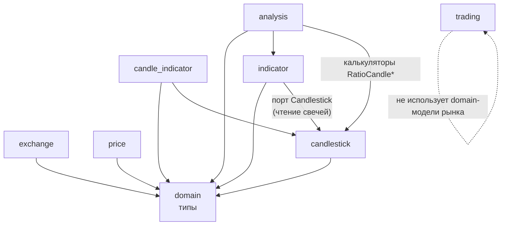
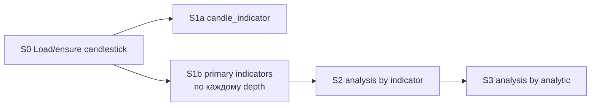

# Core: зависимости и pipeline расчёта

Документ фиксирует, **от чего зависит каждый пакет в `core/`**, и описывает, **как бы я строил расчётный pipeline** поверх этих зависимостей. Код здесь не предписывается — только модель и границы стадий.

Связанный контекст: [overview.md](./overview.md) (процессы loader/calculator, очереди), [описание_работы.md](./описание_работы.md) (глубины и формулы).

---

## 1. Карта пакетов `core/`

| Пакет | Роль | Вход | Выход | Внешний мир через |
| --- | --- | --- | --- | --- |
| `exchange` | Метаданные пар (base/quote, funding) | биржа | `SymbolInfo` | `ExternalLoader` + `Repository` |
| `price` | Последние цены | биржа | `Price` | `ExchangeLoader` + `Repository` |
| `candlestick` | OHLCV-свечи | биржа + таймфрейм | `Candlestick` | `ExchangeLoader` + `Repository` |
| `candle_indicator` | Синтетические свечи (Heiken Ashi) | последовательность свечей | `candle_indicator.Indicator` | `candlestick.Candlestick` + свой `Repository` |
| `indicator` | Первичные индикаторы (MA, EMA, RSI-сырьё и т.д.) | свечи + depth | `domain.Indicator` | локальный порт `Candlestick` + `Repository` + калькуляторы |
| `analysis` | Вторичная и производная аналитика | индикаторы / другая аналитика | `Analytic` | `indicator.Indicator` + `Repository` + калькуляторы (+ иногда свечи внутри калькулятора) |
| `trading` | Чистая математика позиции | параметры позиции | числа (entry, liq, PnL, risk) | **ничего** — без репозиториев и бирж |

`domain` — общие типы (`Candlestick`, `Indicator`, `Unit`, …). Его импортируют все пакеты `core/`; обратных зависимостей нет.

---

## 2. Граф зависимостей между компонентами

Зависимости **только между пакетами `core/`** (репозитории и биржевые клиенты — реализации снаружи и на граф не влияют).



### Что из этого следует

1. **`price` и `exchange` независимы** от свечей и расчётов. Их можно грузить и отдавать в API параллельно с pipeline индикаторов.
2. **`candlestick` — корень рыночного каскада.** Без замкнутой последовательности свечей (`SequenceCandlesticks` / `IsCorrectSequenceCandlesticks`) дальше считать нельзя.
3. **`candle_indicator` и `indicator` — соседние ветки** от одних и тех же свечей. Они не зависят друг от друга: Heiken Ashi не нужен для MA, и наоборот.
4. **`analysis` стоит выше `indicator`.** Сначала первичный индикатор, потом аналитика по нему; поверх части аналитики — ещё один слой (MACD signal / histogram).
5. **`trading` вне каскада.** Это синхронные чистые функции для REST-калькуляторов; события loader/calculator на него не влияют.

### Уровни данных (логически)

```
L0  exchange, price, candlestick     ← сырьё с бирж
L1  candle_indicator                 ← только из candlestick
L2  indicator (primary)              ← только из candlestick
L3  analysis by indicator            ← из indicator (+ иногда candlestick)
L4  analysis by analytic             ← из analysis (L3)
—   trading                          ← вне уровней, по запросу
```

---

## 3. Зависимости калькуляторов (деталь)

### L2 — `indicator` (из свечей)

| Имя | Нужно от свечей |
| --- | --- |
| `MA`, `EMA`, `PriceChanges`, `StochasticMainLine` | окно depth > 1 |
| `Trend` | depth ≥ 10 |
| `TypeCandle`, `VolatilityCandlePercent` | одна свеча (depth = 1) |

Сервис тянет свечи через порт `indicator.Candlestick` (на практике — тот же `candlestick.Service`).

### L1 — `candle_indicator`

| Имя | Нужно |
| --- | --- |
| `HeikenAshi` | упорядоченная последовательность OHLCV |

### L3 — `analysis` по индикатору

| Имя | Зависит от |
| --- | --- |
| `TrendByMA` / `TrendByEMA` | MA / EMA |
| `RatioCandleToMA` / `RatioCandleToEMA` | MA/EMA **и** свеча того же datetime |
| `RSI` | производные от EMA роста/падения |
| `MACDMainLine` | пара EMA (short/long) |
| `StochasticSignalLine` | `StochasticMainLine` |

### L4 — `analysis` по аналитике

| Имя | Зависит от |
| --- | --- |
| `MACDSignalLine` | ряд `MACDMainLine` |
| `MACDSHistogram` | `MACDSignalLine` (и косвенно main line) |

Именно L3→L4 объясняет второй проход по очереди `analytics` в calculator: пока нет main line, signal/histogram считать рано.

---

## 4. Как устроен каскад сейчас (кратко)

Фактический поток процессов описан в [overview.md](./overview.md). С точки зрения `core/` это выглядит так:

```
candlestick сохранён
        │
        ├─► candle_indicator.CalculateAllIndicators / CalculateFromCandlesticks
        │
        └─► indicator.CalcIndicators / CalcIndicatorsByCandlestick
                    │
                    ▼ событие CreatedIndicator
              analysis.CalculateByIndicator          (L3)
                    │
                    ▼ событие CreatedAnalytic
              analysis.CalculateByAnalytics          (L4, пакетно)
```

Оркестрация живёт в `internal/ui/daemon/calculator`: очереди `actions` → `indicators` → `analytics`. Сами сервисы `core/` про очереди не знают — они умеют только «дай вход → посчитай → сохрани».

Ограничения текущей схемы, важные для дизайна pipeline:

- фильтр «только `interval == 1` и не минутки» режется в демоне, не в `core`;
- инкремент завязан на «последняя запись в storage + догнать хвост», а не на явный курсор стадии;
- ошибка/отмена в одном обработчике через `cancel()` гасит весь процесс `daemon serve`;
- L1 и L2 стартуют независимо по одному сигналу — хорошо, но нет общего контракта «стадия завершена для ключа K».

---

## 5. Как бы я строил pipeline

Цель: сделать зависимости из §2 **явными стадиями**, а не неявной цепочкой очередей. `core/` остаётся чистым (функции + порты); оркестратор снаружи вызывает стадии в порядке DAG.

### 5.1. Ключ работы

Одна единица работы — закрытый интервал:

```
Key = (exchange, symbol, unit, interval, datetime)
```

Плюс отдельный поток **backfill** по тому же ключу без `datetime` (догон с курсора). Минутки и `interval != 1` либо не входят в DAG расчёта, либо идут отдельным «лёгким» pipeline только для price/candle storage — как сейчас по смыслу.

### 5.2. Стадии DAG



| Стадия | Вызов в `core/` | Предусловие | Идемпотентность |
| --- | --- | --- | --- |
| **S0** | `candlestick` уже в storage (loader) | биржа отдала свечу, последовательность валидна | upsert свечи |
| **S1a** | `candle_indicator.Calculate…` | S0 для Key | skip если запись есть |
| **S1b** | `indicator.Calc…` × depths | S0 для Key | skip по `(name, depth, datetime)` |
| **S2** | `analysis.CalculateByIndicator` / `AnalyticByIndicators` | нужные L2 для Key | skip по имени/depth |
| **S3** | `analysis.CalculateByAnalytics` | нужные L3 (например MACDMainLine) | пакетный skip через `FindMany` |

`price` / `exchange` — **отдельные pipeline** (расписание loader), не узлы этого DAG.

`trading` — **request-time pipeline** из одного шага: HTTP → чистая функция → ответ. В event DAG не включать.

### 5.3. Курсор вместо «посчитай последние N»

На пару `(exchange, symbol, unit, interval, stage)` хранить курсор `last_datetime`.

Алгоритм стадии:

1. Прочитать курсор.
2. Взять из storage входы строго после курсора (свечи / индикаторы / аналитику).
3. Посчитать пачку, сохранить.
4. Сдвинуть курсор только после успешного commit пачки.

Так `core/` остаётся про расчёт одного окна, а «догнать дыру» становится свойством оркестратора — это совпадает с идеей из TODO проекта («у свечей должен быть курсор»).

### 5.4. Параллелизм

Безопасно параллелить:

- разные `Key` (разные symbol/timeframe);
- **S1a ∥ S1b** для одного Key (нет зависимости);
- внутри S1b — разные `depth` и имена калькуляторов, если запись в storage идемпотентна.

Нельзя параллелить без барьера:

- S2 до завершения нужных имён S1b для того же datetime;
- S3 до появления строки L3, от которой зависит осциллятор.

Практический барьер: после S1b публиковать не «один индикатор = одно сообщение», а **watermark Key**: «для datetime T все primary depths готовы» → один вход в S2. Это убирает лишний fan-out и повторные `FindMany`.

### 5.5. Очереди: tonкие сигналы, толстый state

Оставляю PostgreSQL/`queues` (или Rabbit) только как **транспорт сигналов**:

```
CandleClosed(Key)        → планировщик ставит S1a+S1b
PrimaryReady(Key)        → S2
AnalyticL3Ready(Key, names) → S3
```

Тела свечей/индикаторов в очередь не класть: источник истины — таблицы `candlestick` / `indicators` / `analytics`. Calculator и так почти так работает (`LoadedCandlesticks` без тела); я бы довёл это до конца и для L3→L4 (сейчас в очередь уходит сама аналитика — удобно для батча, но дублирует storage).

### 5.6. Backfill vs realtime

Два режима одного DAG:

| Режим | Триггер | Размер пачки | Приоритет |
| --- | --- | --- | --- |
| **realtime** | закрытие свечи / `LoadedCandlesticks` | 1…несколько datetime | высокий |
| **backfill** | дыра у курсора, новый symbol, смена depths | сотни точек, `CalculateByAnalytics`-стиль | низкий, отдельный worker pool |

Оба вызывают те же методы `core/`; отличается только оркестратор и лимиты concurrency. Это снижает риск OOM: realtime не тащит полную историю, backfill ограничен воркерами и размером пачки.

### 5.7. Наблюдаемость стадии

Метрики на узел DAG, не на «весь calculator»:

- `pipeline_stage_lag_seconds{stage, unit}` — now − cursor;
- `pipeline_stage_duration_seconds`;
- `pipeline_stage_errors_total`;
- `pipeline_keys_in_flight`.

Тогда «сервис падает / тормозит» читается как «S1b отстаёт на 1h» или «S3 взрывается по MACD», а не как общий restart процесса.

### 5.8. Чего бы я не делал

- Не тащить SQL/HTTP в `core/` — порты `Repository` / `Candlestick` оставить.
- Не смешивать `trading` с event pipeline.
- Не считать L4 из сырых свечей в обход L2/L3 — граф зависимостей выше должен оставаться единственным путём.
- Не гасить весь процесс из-за ошибки одной стадии одного Key: retry/DLQ на ключ, остальное работает.

---

## 6. Сводка «кто от кого»

```
exchange ──────────────────────────────────────────► API / dictionary
price ─────────────────────────────────────────────► API
candlestick ──┬──► candle_indicator ───────────────► API
              └──► indicator ──► analysis(L3) ──► analysis(L4) ──► API
trading (pure) ────────────────────────────────────► API (POST calculator)
```

**Минимальный порядок для рыночной аналитики по одной паре и таймфрейму:**  
`candlestick` → (`candle_indicator` ∥ `indicator`) → `analysis L3` → `analysis L4`.

Именно этот порядок я бы закрепил в оркестраторе как явный pipeline; `core/` уже почти разложен по этим слоям — не хватает в основном курсоров, watermark’ов между стадиями и изоляции ошибок по Key.
