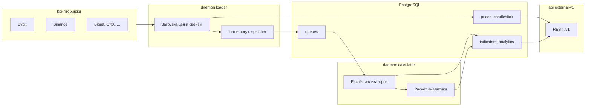

# Crypto Polymath — обзор проекта

## Назначение

**Crypto Polymath** — серверная платформа для технического анализа криптовалютных рынков. Система:

- загружает рыночные данные с криптобирж (цены, свечи, информацию о торговых парах);
- рассчитывает технические индикаторы и производную аналитику (осцилляторы);
- сохраняет результаты в PostgreSQL;
- отдаёт данные через REST API и gRPC.

Проект ориентирован на автоматизированный сбор и расчёт показателей для множества торговых пар и таймфреймов, а не на ручной анализ одного графика.

---

## Архитектура высокого уровня

Приложение состоит из **трёх независимых процессов**, которые можно запускать отдельно (в Docker — отдельные контейнеры):

| Процесс | Команда | Назначение |
|---------|---------|------------|
| **Loader** | `daemon loader` | Загрузка данных с бирж, запись в БД, генерация событий |
| **Calculator** | `daemon calculator` | Расчёт индикаторов и аналитики по событиям из очереди |
| **API** | `api external-v1` | HTTP REST API для чтения данных клиентами |

Общая схема:



Все процессы используют общий **DI-контейнер** (`cmd/container`) на базе `go.uber.org/dig`: подключения к БД, репозитории, сервисы и клиенты бирж регистрируются один раз при старте.

---

## Слои кодовой базы

```
crypto_polymath/
├── cmd/                    # CLI (cobra): daemon, api, script migrate
├── domain/                 # Доменные модели и константы
├── core/                   # Бизнес-логика (сервисы и калькуляторы)
│   ├── price/
│   ├── candlestick/
│   ├── indicator/
│   ├── analysis/
│   ├── candle_indicator/
│   ├── exchange/
│   └── trading/            # Вспомогательные торговые расчёты
├── internal/
│   ├── infrastructure/     # PostgreSQL, адаптеры бирж, in-memory кеш
│   ├── event/listeners/    # Публикация событий в очереди
│   └── ui/                 # Демоны (loader, calculator), REST, gRPC, web
├── api/                    # OpenAPI-спека и контракты очередей
├── pkg/                    # Общие утилиты (queue, metrics, server)
└── migrations/             # SQL-миграции (postgres, sqlite)
```

**Принцип разделения:**

- `domain` — чистые структуры (`Candlestick`, `Indicator`, события, единицы времени `m`, `H`, `D`, `W`, `M`).
- `core` — интерфейсы сервисов и реализация расчётов; не зависит от HTTP/БД напрямую.
- `internal/infrastructure` — реализация репозиториев, адаптеры к API бирж.
- `internal/ui` — точки входа (демоны, HTTP-handlers).

---

## Поддерживаемые биржи

| Биржа | Цены | Свечи | Метаданные символов |
|-------|------|-------|---------------------|
| Binance | ✓ | — | — |
| Bitget | ✓ | — | — |
| Bybit | ✓ | ✓ (основной источник) | ✓ (futures) |
| Gate.io | ✓ | — | — |
| Kraken | ✓ | — | — |
| KuCoin | ✓ | — | — |
| MEXC | ✓ | — | — |
| OKX | ✓ | — | — |

**Bybit** — основной источник свечей и информации о фьючерсных парах. Остальные биржи используются преимущественно для агрегации текущих цен.

Клиенты бирж подключаются через внешние библиотеки `crypto_loader` и `crypto-exchanges`.

---

## Процесс Loader (`daemon loader`)

Демон `internal/ui/daemon/loader` выполняет периодическую загрузку данных по расписанию.

### Загрузка цен

Для каждой из 8 бирж в отдельной горутине:

1. Запрашиваются текущие цены через `core/price`.
2. Данные сохраняются в таблицу `prices`.
3. Генерируется событие `LoadedPricesByExchangeAction`.

Интервал задаётся конфигом `price.duration.loader` (по умолчанию 30 секунд).

### Загрузка свечей (Bybit)

Для символов из конфигов `load.symbols` и `load.hot_symbols`:

| Таймфрейм | Расписание | Примечание |
|-----------|------------|------------|
| Минутные (`candlestick.minutes`: 1, 15, 30) | Каждые N минут | Только для `hot_symbols` |
| Часовые (`candlestick.hours`: 1, 2, 4, 6, 12) | Каждый час + slippage 1 с | Для всех символов |
| Дневные / недельные / месячные | Раз в сутки | interval = 1 |
| Часовые futures | Каждый час | Все пары категории future с Bybit |

После загрузки свечей:

1. Публикуется событие `LoadedCandlesticksForSymbolAction` (сигнал «свечи загружены», без передачи самих свечей).
2. Для свечей с `unit != m` и `interval == 1` публикуется `CreatedCandlestickEvent` с телом свечи.

Минутные свечи и свечи с `interval != 1` **не попадают** в пайплайн расчёта индикаторов.

### Прочие задачи Loader

- **Метаданные символов** — раз в 5 минут загружается информация о фьючерсных парах Bybit (`symbol_infos`: base/quote asset, funding rate).
- **Словарь для фронта** — раз в час вызывается `service.Collect()`: собирается кеш доступных символов, интервалов, индикаторов и аналитики для REST `/dictionary`.
- **Очистка** — раз в сутки удаляются устаревшие цены (старше 24 ч) и свечи сверх лимита `candlestick.storage.limit`.

### gRPC

Loader поднимает gRPC-сервер (`grpc.port`, по умолчанию 50052) с сервисом `ActionService`. При событии загрузки свечей клиенты могут получать push-уведомление через `ActionHandler.Accept`.

---

## Поток событий и очереди

Система использует **двухуровневую** доставку событий.

### 1. In-memory dispatcher

Внутри каждого процесса работает `dispatcher.Dispatcher[T]` из `go-template`:

- асинхронная обработка подписчиков (`Listen()`);
- метрики Prometheus (`EventCount`, `EventDurationQuery`).

Типы диспетчеров:

| Тип | Событие | Назначение |
|-----|---------|------------|
| `LoadedCandlesticksActionBody` | `LoadedCandlesticksForSymbolAction` | Сигнал о загрузке свечей |
| `Candlestick` | `CreatedCandlestickEvent` | Новая свеча |
| `Indicator` | `CreatedIndicatorEvent` | Рассчитанный индикатор |
| `Analytic` | `CreatedAnalyticEvent` | Рассчитанная аналитика |
| `candle_indicator.Indicator` | `CreatedIndicatorEvent` | Свечной индикатор (Heiken Ashi) |

### 2. Публикация в очереди

Слушатели (`internal/event/listeners`) записывают события в **PostgreSQL-таблицу `queues`** (JSON-тело, TTL 2 часа):

```
Loader:  LoadedCandlesticks → queues (actions)
         Candlestick          → queues (candlesticks)

Calculator: Indicator       → queues (indicators)
            Analytic         → queues (analytics)
            CandleIndicator  → queues (candle_indicators)
```

Параллельно настроены **RabbitMQ** producer/consumer (очереди `actions`, `candlesticks`, `indicators`, `analytics`, `candle_indicators`), но Calculator **читает из PostgreSQL** через `QueueRepository.Receive()`.

### Алгоритм расчёта (каскад событий)

```
1. Loader загружает свечи
       ↓
2. LoadedCandlesticksForSymbolAction → Calculator
       ↓
3. Calculator:
   a) candle_indicator.CalculateAllIndicators (Heiken Ashi)
   b) indicator.CalcIndicators для каждой depth из candlestick.depths
       ↓
4. CreatedIndicatorEvent → Calculator.handleIndicators
       ↓
5. analysis.CalculateByIndicator (RSI, MACD, TrendByEMA, ...)
       ↓
6. CreatedAnalyticEvent → Calculator.handleAnalytic (пакетно)
       ↓
7. analysis.CalculateByAnalytics → OscillatorByAnalytics (MACD Signal Line, MACD Histogram)
```

Calculator **пропускает** минутные свечи и свечи с `interval != 1` — расчёт ведётся только для «базовых» часовых/дневных/недельных/месячных интервалов с `interval = 1`.

**Пакетная обработка аналитики:** `handleAnalytic` не вызывает расчёт по одному сообщению. Сообщения из очереди `analytics` группируются по `exchange/symbol/unit/interval`, сортируются по `Datetime` и передаются в `CalculateByAnalytics` одним вызовом. Внутри сервис использует `OscillatorByAnalytics` с пакетным `FindMany` по всем `datetime` батча — вместо отдельного round-trip в БД на каждое событие.

---

## Процесс Calculator (`daemon calculator`)

Демон `internal/ui/daemon/calculator` — потребитель очередей и вычислительный движок.

### Обработчики

| Очередь | Обработчик | Действие |
|---------|------------|----------|
| `actions` | `handleAction` | По сигналу загрузки — расчёт candle indicators + primary indicators |
| `candlesticks` | `handleCandlestick` | Пересчёт candle indicators по одной свече |
| `indicators` | `handleIndicators` | Расчёт аналитики по индикатору |
| `analytics` | `handleAnalytic` | Пакетный расчёт производной аналитики (MACD signal/histogram) |
| `candle_indicators` | `handleCandleIndicatorConsumer` | Заглушка (не реализовано) |

### Оптимизация `listenAnalytic`

Потребитель очереди `analytics` (`listenAnalytic`):

1. Читает пачку сообщений из `QueueRepository.Receive()`.
2. Группирует по struct-ключу `{exchange, symbol, unit, interval}` (без аллокаций на `fmt.Sprintf`).
3. Обрабатывает каждую группу в errgroup с лимитом 50 горутин.
4. Внутри группы `handleAnalytic` вызывает `CalculateByAnalytics` один раз на весь батч.

Аналогичный паттерн группировки используется в `listenAction`, `listenCandlestick`, `listenIndicators`.

### API сервиса аналитики (`core/analysis`)

| Метод | Назначение |
|-------|------------|
| `CalculateByIndicator` | Аналитика по одному первичному индикатору |
| `AnalyticByIndicators` | Пакет по нескольким индикаторам (один `FindMany`) |
| `CalculateByAnalytic` | Обёртка над `CalculateByAnalytics` для одного события |
| `CalculateByAnalytics` | Пакет производной аналитики по нескольким `Analytic` |
| `OscillatorByAnalytics` | Расчёт одного осциллятора по батчу с общим `FindMany` |

`CalculateByAnalytic` делегирует в `CalculateByAnalytics([]Analytic{data})`, чтобы единая логика использовалась и в демоне, и в точечных вызовах.

### Очистка данных

- Индикаторы старше `indicator.storage.limit` записей на группу — ежедневно.
- Аналитика старше `analysis.storage.limit` — ежедневно.

---

## Индикаторы и аналитика

Показатели делятся на **три уровня**.

### Первичные индикаторы (`core/indicator`)

Рассчитываются **напрямую из свечей**:

| Имя | Описание | Требования к depth |
|-----|----------|-------------------|
| `MA` | Простая скользящая средняя | depth > 1 |
| `EMA` | Экponential moving average | depth > 1 |
| `Trend` | Направление тренда по экстремумам | depth ≥ 10 |
| `TypeCandle` | Направление свечи (+1 / −1) | depth = 1 |
| `VolatilityCandlePercent` | Волатильность свечи в % | depth = 1 |
| `PriceChanges` | Изменение цены за N свечей | depth > 1 |
| `StochasticMainLine` | Стохастик, основная линия | depth > 1 |

Сервис инкрементально догоняет пропущенные свечи: находит последний сохранённый индикатор, определяет следующий закрытый интервал и считает только новые значения.

### Вторичная аналитика (`core/analysis`)

Рассчитывается **на основе первичных индикаторов** (`CalculatorByIndicator`):

| Имя | Зависит от | depth |
|-----|------------|-------|
| `TrendByMA` | MA | ≥ 10 |
| `TrendByEMA` | EMA | ≥ 10 |
| `RatioCandleToMA` | MA + свеча | 1 |
| `RatioCandleToEMA` | EMA + свеча | 1 |
| `RSI` | EMA роста/падения | ≥ 10 |
| `MACDMainLine` | EMA short − EMA long | 26 |
| `StochasticSignalLine` | StochasticMainLine | 3 |

### Производная аналитика (`CalculatorByAnalytic`)

Рассчитывается **на основе другой аналитики**:

| Имя | Зависит от | depth (SupportDepth) |
|-----|------------|----------------------|
| `MACDSignalLine` | MACDMainLine | 1 (сглаживание по 9 последним точкам main line) |
| `MACDSHistogram` | MACDSignalLine | 1 |

Подробные формулы и требования к глубине — в [описание_работы.md](./описание_работы.md) и [индикаторы.md](./индикаторы.md).

### Свечные индикаторы (`core/candle_indicator`)

Отдельный тип данных — **синтетические свечи**, хранятся в `candlestick_indicators`:

| Имя | Описание |
|-----|----------|
| `HeikenAshi` | Свечи Хейкен Аши |

---

## Хранение данных

### PostgreSQL (схема `crypto_polymath`)

| Таблица | Содержимое |
|---------|------------|
| `prices` | Последние цены по бирже и символу |
| `candlestick` | OHLCV-свечи |
| `indicators` | Первичные индикаторы |
| `analytics` | Вторичная и производная аналитика |
| `candlestick_indicators` | Свечные индикаторы (Heiken Ashi) |
| `symbol_infos` | Метаданные торговых пар |
| `queues` | Очередь событий (JSON) |

### In-memory кеш

Для горячих данных используется двухуровневый репозиторий (`internal/infrastructure/adapters/repository`):

- **PostgreSQL** — постоянное хранение;
- **memory** — LRU-кеш с лимитом (`candlestick.storage.limit`, `indicator.storage.limit`, `analysis` — 100 записей).

При чтении сначала проверяется память, при промахе — БД с последующим кешированием.

---

## REST API (`api external-v1`)

HTTP-сервер на Echo, спецификация — OpenAPI 3 (`api/rest/v1/openapi.yaml`), код handlers генерируется через oapi-codegen.

Базовый путь: `/v1`.

### Основные группы эндпоинтов

| Группа | Примеры | Описание |
|--------|---------|----------|
| **Server** | `GET /server` | Информация о сервере |
| **Prices** | `GET /prices/exchange/{exchange}` | Цены по бирже |
| | `GET /prices/symbol/{symbol}` | Цены символа на всех биржах |
| | `GET /price/{exchange}/{symbol}` | Одна цена |
| **Candlesticks** | `GET /candlestick/{exchange}/{symbol}/{unit}/{interval}` | Свечи |
| **Indicators** | `GET /indicator/...` | Первичные индикаторы |
| **Analysis** | `GET /analysis/...` | Аналитика (RSI, MACD, ...) |
| **Dictionary** | `GET /dictionary` | Словарь символов, интервалов, индикаторов |
| **Exchange** | `GET /exchange/...` | Информация о биржах и символах |

Параметры `depth` и `indicator_depth` фильтруются по конфигу `candlestick.depths`.

Также отдаётся статическая главная страница (`internal/ui/web/static/index.html`).

---

## Конфигурация

Настройки через **переменные окружения** (Viper `AutomaticEnv`, точки заменяются на `_`).

Ключевые параметры (значения по умолчанию — `internal/config/default.go`):

```text
# База данных
DB_CONNECTION_DRIVER=postgres
DB_CONNECTION_HOST=0.0.0.0
DB_CONNECTION_PORT=5433
DB_CONNECTION_DATABASE=crypto_app
DB_CONNECTION_SCHEMA=crypto_polymath

# Свечи
CANDLESTICK_MINUTES=1,15,30
CANDLESTICK_HOURS=1,2,4,6,12
CANDLESTICK_DEPTHS=1,8,9,10,12,14,20,26,50
CANDLESTICK_STORAGE_LIMIT=200

# Символы
LOAD_SYMBOLS=BTCUSDT,ETHUSDT,TONUSDT
LOAD_HOT_SYMBOLS=BTCUSDT,ETHUSDT,TONUSDT

# Сервисы
METRIC_PORT=8080
HTTP_PORT=80
GRPC_PORT=50052
PRICE_DURATION_LOADER=30s

# Очереди
EVENTS_QUEUE_ACTION=actions
EVENTS_QUEUE_CANDLESTICK=candlesticks
EVENTS_QUEUE_INDICATOR=indicators
EVENTS_QUEUE_ANALYTIC=analytics
```

---

## CLI-команды

```bash
# Загрузчик данных
crypto_polymath daemon loader

# Калькулятор индикаторов
crypto_polymath daemon calculator

# REST API
crypto_polymath api external-v1

# Миграции БД
crypto_polymath script migrate
```

При старте каждого процесса:

- инициализируется DI-контейнер;
- поднимается сервер метрик Prometheus (`metric.port`);
- включается pprof на `:6060`;
- graceful shutdown по SIGINT/SIGTERM.

---

## Развёртывание

`docker-compose-dev.yaml` описывает стек:

| Сервис | Порт | Команда |
|--------|------|---------|
| `app-external-v1` | 80, 8080 | `api external-v1` |
| `app-loader` | 8081, 50052 | `daemon loader` |
| `app-calculator` | 8082 | `daemon calculator` |
| `postgres` | 5433 | PostgreSQL  |
| `postgres_exporter` | 9187 | Метрики БД |
| `cadvisor` | 8090 | Метрики контейнеров |

Образ собирается из `deployments/app.Dockerfile` (Go 1.23).

Миграции: `migrations/postgres/migration.sql`.

---

## Метрики и наблюдаемость

- **Prometheus** — HTTP middleware для REST, метрики событий, HTTP-клиентов бирж, loader/calculator.
- **pprof** — профилирование на `:6060`.
- **Sentry** — интеграция через `go-template` (DSN в конфиге).
- **Structured logging** — zap с отдельными namespace-логгерами (`loader`, `calculator`, `http_server`, ...).

---

## Вспомогательные модули

### `core/trading`

Утилиты для маржинальной торговли: усреднение позиции, ликвидация, PnL, риски, **динамический SL от волатильности** (`Future.DynamicStopLoss`). Подробнее — [core/trading/readme.md](../core/trading/readme.md). Стратегия Heiken Ashi и бэктест — [HeikenAshi.md](./HeikenAshi.md).

### `domain/calculator`

Общие математические функции для индикаторов (например, `EMA`).

---

## Тестирование и performance

Бизнес-логика в `core/` покрыта **unit-тестами** на in-memory репозиториях и стаб-калькуляторах — без локальной БД и сети.

```bash
# Все unit-тесты core
go test ./core/...

# Benchmarks с аллокациями
go test ./core/... -bench=. -benchmem -run=^$

# Сравнение пакетной и поштучной обработки аналитики
go test ./core/analysis/... -bench='CalculateByAnalytics|CalculateByAnalytic_perMessage' -benchmem -run=^$
```

### Покрытие по пакетам

| Пакет | Тесты | Benchmarks |
|-------|-------|------------|
| `core/analysis` | `CalculateByAnalytics`, `OscillatorByAnalytics`, `CalculateByIndicator`, `isCorrectSequence` | batch n=1/10/100/1000, cached, per-message |
| `core/indicator` | `CalcIndicatorsByCandlestick`, `CalculateLastSequence` | cold/cached, sequence n=10/100/1000 |
| `core/candle_indicator` | `CalculateFromCandlesticks`, `Indicator` helpers | batch n=10/100/1000 |
| `core/exchange` | `LoadSymbolInfo`, `SymbolInfo` | — |
| `core/trading` | `NewAvgEntryPrice`, `DynamicStopLoss`, `UpdateTrailingStop` | entry price |
| `core/analysis/calculators` | `SupportDepth` для MACD | — |

На батче из 100 сообщений `CalculateByAnalytics` даёт примерно **2× меньше времени** и **~10× меньше аллокаций**, чем цикл из 100 вызовов `CalculateByAnalytic` (см. `core/analysis/service_bench_test.go`).

---

## Связанная документация

| Файл | Содержание |
|------|------------|
| [info.md](./info.md) | Базовые понятия технического анализа |
| [алгоритм.md](./алгоритм.md) | Алгоритм каскадной обработки свечей и индикаторов |
| [описание_работы.md](./описание_работы.md) | Требования depth/interval для каждого индикатора |
| [индикаторы.md](./индикаторы.md) | Формулы MA, EMA, MACD, RSI, Stochastic |
| [паттерны.md](./паттерны.md) | Свечные и графические паттерны (справочник) |
| [HeikenAshi.md](./HeikenAshi.md) | Стратегия разворота HA, динамический SL, результаты бэктеста |

---

## Технологический стек

- **Go 1.24** (mod), CLI — **Cobra**
- **PostgreSQL** + **sqlx**
- **RabbitMQ** (streadway/amqp) + PostgreSQL-очередь
- **Echo** + **oapi-codegen** (REST)
- **gRPC** + protobuf
- **Prometheus**, **zap**, **viper**, **dig** (DI)
- Внешние SDK: `crypto_loader`, `crypto-exchanges`, `go-template`
